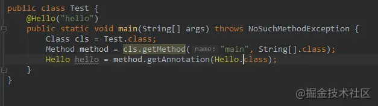
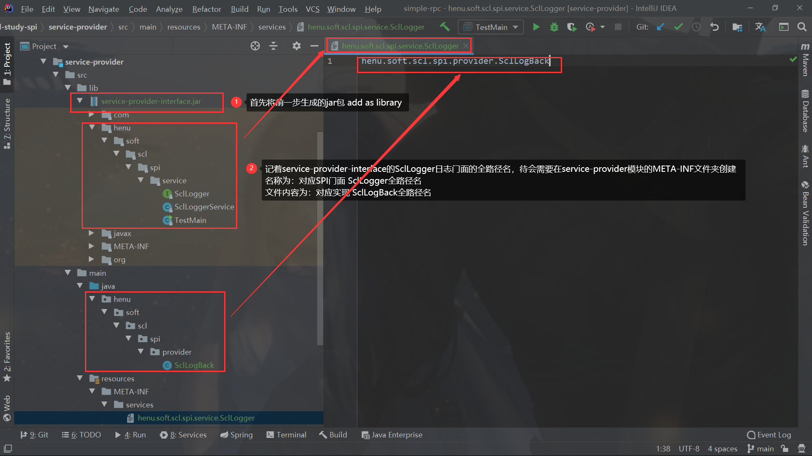
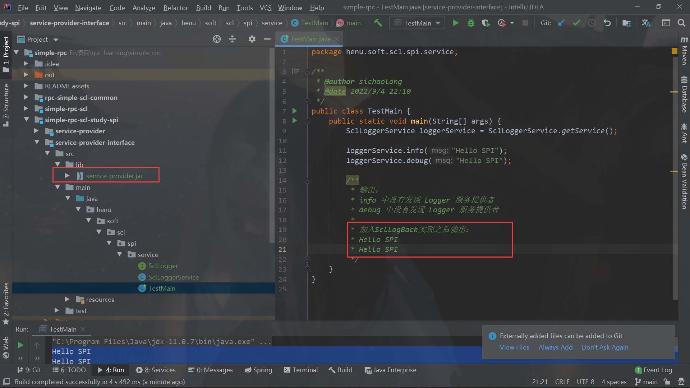

## simple-rpc-scl 自己实现一个简易的RPC框架


### 前言

模块结构

```java

simple-rpc
  /-- rpc-simple-scl-common // rpc依赖的公共模块，SPI注解和实现就是在此实现
  /-- simple-rpc-scl // rpc
  /-- simple-rpc-scl-test // 测试使用rpc
  	 /-- simple-rpc-scl-api //provider的 api接口
  	 /-- simple-rpc-scl-consumer
  	 /-- simple-rpc-scl-provider
  /-- simple-rpc-study-spi // 学习SPI机制原理与实践
     /-- service-provider-interface // 日志门面模块，也就是具体的SPI
     /-- service-provider // SPI的某一种实现
```


### 概述

一个RPC框架需要具备远程通信方式、通信协议、序列化方式等组件，需要动态代理实现本地存根等。除了基本的远程调用能力，还需要一定的服务治理能力，比如服务的注册发现的注册中心、保护系统流控作用的负载均衡策略、分析错误的链路追踪以及一些基础的日志记录、配置方式等。

将RPC的需求优先级排序，主要分为三步实现：1、实现远程调用相关能力。2、必要的服务治理如注册、发现、负载均衡、路由、容错机制等。3、链路追踪、应用监控、故障告警能力等。

文章主要内容：

1. 《深入理解RPC框架与实现》书中实现的一个简单的RPC实践与原理分析，主要是使用下列组件库完成：Spring、Netty、log4j、Javassit和Cglib、Zookeeper、curator(最为Zookeeper的客户端实现)、Protostuff。因为使用的是Spring，因此需要xml配置文件配置使用，不是很方便，而且组件基本是写死某一种的如Netty、序列化方案Protostuff都是耦合的，不满足开闭原则不利于后续拓展。
2. 参考另外一个RPC开源框架guide-rpc，相对上述书中实现的RPC，该RPC更加完善，包括请求消息体RpcRequest、消息返回题RpcResponse体的字段设计更加完善，该开源项目主要优点有：1、工程使用SpringBoot可以借助自定义注解`@SclRpcService、@SclRpcReference、@SclRpcSacn`等注解方便快速使用，2、基于SPI的原理实现组件的可插拔，方便拓展。


### 1、《深入理解RPC框架与原理》中简易RPC实现步骤与原理分析

### （1）实现远程调用

过程需要：制定RPC协议、制定序列化方法，实现编解码、实现远程通信、实现本地存根

制定RPC协议很重要，主要就是Request、Response消协议头、协议体字段的一些设计，主要关注的就是消息协议体的内容。参考书中作者的设计的Request、Response。从源码中可以看到Request包含的字段是发起一次请求的必须的内容，返回字段包含在Response，在一次RPC请求中，他们不断的被序列化、反序列化。Request、Response类主要在源码中remoting包下


- Request类属性：requestId、服务名称className、方法名methodName、 参数类型types、参数args、客户端应用名称clientApplicationName、clientIp、服务serviceConfig（也就是存储在注册中心如Zookeeper的抽象信息）
  - ServiceConfig类：Spring上下文applicationContext、id、服务名name、实现名impl、服务引用名ref、ip、port、version
- Response类属性：requestId、result、isSuccess

其他核心类


### （2）定制序列化、编解码方案

请求和响应以什么样的数据格式在网络中传输，可以使用Protostuff进行序列化、反序列化（**将对象转为字节流数组、将字节流数组转为对象**）。使用Encoder、Decoder进行编解码，其中编解码依赖Protostuff，因为采用Netty作为远程通信实现方案，所以在编解码采用Netty的MessageToByteEncoder、ByteToMessageDecoder类，通过自定义Encoder、Decoder类实现他们重写方法内部调用Protostuff完成编解码。简单理解就是Netty整合序列化方案Protostuff的媒介。


相关类主要在源码包serialzation、remoting包下的codec包下。Decoder、Encoder类

```java
public class Decoder extends ByteToMessageDecoder {
    private Class<?> genericClass;

    public Decoder(Class<?> genericClass) {
        this.genericClass = genericClass;
    }

    @Override
    public void decode(ChannelHandlerContext ctx, ByteBuf in, List<Object> out) throws Exception {
        if (in.readableBytes() < 4) {
            return;
        }
        in.markReaderIndex();
        int dataLength = in.readInt();
        if (dataLength < 0) {
            ctx.close();
        }
        if (in.readableBytes() < dataLength) {
            in.resetReaderIndex();
            return;
        }
        byte[] data = new byte[dataLength];
        in.readBytes(data);

        Object obj = ProtostuffSerialization.deserialize(data, genericClass);
        out.add(obj);
    }
}


public class Encoder extends MessageToByteEncoder {

    private Class<?> genericClass;

    public Encoder(Class<?> genericClass) {
        this.genericClass = genericClass;
    }

    @Override
    public void encode(ChannelHandlerContext ctx, Object msg, ByteBuf out) throws Exception {
        if (genericClass.isInstance(msg)) {
            byte[] data = ProtostuffSerialization.serialize(msg);
            out.writeInt(data.length);
            out.writeBytes(data);
        }
    }
}

```

ProtostuffSerialization类

```java
public class ProtostuffSerialization {

    private static Map<Class<?>, Schema<?>> cachedSchema = new ConcurrentHashMap<Class<?>, Schema<?>>();

    private static Objenesis objenesis = new ObjenesisStd(true);

    private ProtostuffSerialization() {
    }

    /**
     * 从缓存中获取schema，如果没有则创建schema并且缓存schema
     * @param cls
     * @param <T>
     * @return
     */
    @SuppressWarnings("unchecked")
    private static <T> Schema<T> getSchema(Class<T> cls) {
        Schema<T> schema = (Schema<T>) cachedSchema.get(cls);
        if (schema == null) {
            schema = RuntimeSchema.createFrom(cls);
            // 构建schema的过程可能会比较耗时，因此希望使用过的类对应的schema能被缓存起来
            cachedSchema.put(cls, schema);
        }
        return schema;
    }

    @SuppressWarnings("unchecked")
    public static <T> byte[] serialize(T obj) {
        // 获得对象的类
        Class<T> cls = (Class<T>) obj.getClass();
        // 使用LinkedBuffer分配一块默认大小的buffer空间
        LinkedBuffer buffer = LinkedBuffer.allocate(LinkedBuffer.DEFAULT_BUFFER_SIZE);
        try {
            // 通过对象的类构建对应的schema
            Schema<T> schema = getSchema(cls);
            // 使用给定的schema将对象序列化为一个byte数组，并返回
            return ProtostuffIOUtil.toByteArray(obj, schema, buffer);
        } catch (Exception e) {
            throw new IllegalStateException(e.getMessage(), e);
        } finally {
            buffer.clear();
        }
    }

    public static <T> T deserialize(byte[] data, Class<T> cls) {
        try {
            // 实例化一个类的对象
            T message = objenesis.newInstance(cls);
            // 通过对象的类构建对应的schema
            Schema<T> schema = getSchema(cls);
            // 使用给定的schema将byte数组和对象合并
            ProtostuffIOUtil.mergeFrom(data, message, schema);
            return message;
        } catch (Exception e) {
            throw new IllegalStateException(e.getMessage(), e);
        }
    }
}
```


### （3）实现远程通信

采用Netty实现，主要是编写server端启动监听方法start、Client端连接connectServer、远程调用remoteCall方法处的逻辑。以及对应的ClientHandler、ServerHandler处理逻辑。除此之外还有连接超时的处理RpcReadTimeoutHandler，相关类主要在remoting包下的netty包下。

目前先使用直连的方式（后面会引进注册中心就不在需要），也就是client写死需要连接的server的port、ip。client需要关注两点

- 第一是采用直连模式，只需要将配置中配置的server的port、ip映射到ServiceReferenceConfig类的directServerPort、directServerIp即可完成与client的连接与远程通信。
- 第二是client的remoteCall方法是为本地存根提供的，屏蔽了远程调用的细节，也就是调用本地方法转到了remoteCall方法借助Netty实现远程通信。


```java
  // netty-client发起请求到netty-server
    public Response remoteCall(Request request) throws Throwable {

        // 发送请求
        channelFuture.channel().writeAndFlush(request).sync();
        channelFuture.channel().closeFuture().sync();

        // 接收响应
        Response response = clientHandler.getResponse();
        logger.info("receive a response from the server：" + response.getRequestId());

        if (response.getSuccess()) {
            return response;
        }

        throw response.getError();
    }

public class ClientHandler extends ChannelInboundHandlerAdapter {

    private Response response;

    @Override
    public void channelRead(ChannelHandlerContext ctx, Object msg) throws Exception {
        this.response = (Response) msg;
    }

    @Override
    public void channelReadComplete(ChannelHandlerContext ctx) throws Exception {
        ctx.flush();
        ctx.close();
    }

    public Response getResponse() {
        return response;
    }

    public void setResponse(Response response) {
        this.response = response;
    }
}

```


### （4）实现本地存根


采用两种方案Javassit复杂方式和Cglib实现动态代理实现本地存根，与Javassit相关的类有：ClassGenerator、Proxy、JavassitProxyFactory、InvokerInvocationHandler。与Cglib相关的类有：CglibProxyFactory、InvokerMethodInterceptor。

简单来说就是本地存根就是在InvokerInvocationHandler、InvokerMethodInterceptor中的invoke方法实现。以InvokerInvocationHandler为例分析，可以看到ServiceReferenceConfig、ServiceInstanceConfig类，这两个是核心类

- ServiceInstanceConfig：封装了服务的port、ip、服务接口、接口实现类等有关服务内容，一个ServiceInstanceConfig实例代表一个服务的实例信息。
- ServiceReferenceConfig：封装了服务引用所需内容，比如需要引用的服务接口，服务实现类等。

```java
@Override
    public Object invoke(Object proxy, Method method, Object[] args) throws Throwable {
        return invoke(method.getName(), method.getParameterTypes(), args);
    }

    public Object invoke(String methodName, Class[] argTypes, Object[] args) throws Throwable {
        // 代理对象同步调用remoteCall
        return remoteCall(serviceReferenceConfig, methodName, argTypes, args);
    }

	// 通过remoteCall方法借助Netty实现通信
    private Object remoteCall(ServiceReferenceConfig refrence, String methodName, Class[] argTypes, Object[] args) throws Throwable {
        // 准备请求参数
        Request request = new Request();
        // 请求id
        request.setRequestId(RpcContextConfig.getUuid().get());
        request.setClientApplicationName(RpcContextConfig.getApplicationName());
        request.setClientIp(RpcContextConfig.getLocalIp());
        // 必要参数
        request.setClassName(serviceReferenceConfig.getName());
        request.setMethodName(methodName);
        request.setTypes(getTypes(argTypes));
        request.setArgs(args);
        Response response;
        try {
            Client client = new Client(refrence);
            ServiceRegistryConfig service = client.connectServer();
            request.setService(service);
            response = client.remoteCall(request);
            return response.getResult();
        } catch (Throwable e) {
            logger.error(String.valueOf(e));
            throw e;
        }
    }


    /**
     * 获取方法的参数类型
     *
     * @param methodTypes
     * @return
     */
    private String[] getTypes(Class<?>[] methodTypes) {
        String[] types = new String[methodTypes.length];
        for (int i = 0; i < methodTypes.length; i++) {
            types[i] = methodTypes[i].getName();
        }
        return types;
    }
```


### （5）实现服务治理

需要增加三个服务治理的能力：服务注册、发现、负载均衡。注册发现采用Zookeeper实现，Zookeeper的客户端采用curator-framework实现，也就是ServcieConfig服务抽象信息需要保存在Zookeeper中，新建registry包下的ZookeeperClient类，主要任务是创建微服务注册之后的节点。创建ServciceChangeListener监听服务Service改变之后进行响应的处理逻辑。

服务注册：ServiceIntsanceConfig服务实例注册的时机是在Bean初始化机制调用的，ServiceIntsanceConfig作为一个Bean，实现了initiallizingBean接口、afterProperties方法，因此在Bean完成初始化之后会调用afterProperties方法，进而调用ZookeeperClient的registerService方法

```java
 /**
     * 发布服务到注册中心
     *
     * @throws Exception
     */
    private void registerService() throws Exception {
        ServiceRegisterProperties register = (ServiceRegisterProperties) SpringUtil.getApplicationContext().getBean("register");
        ServiceInstanceConfig server = (ServiceInstanceConfig) applicationContext.getBean("server");

        this.setPort(server.getPort());

        // zookeeper
        String basePath = "/samples/" + this.getName() + "/provider";
        String path = basePath + "/" + InetAddress.getLocalHost().getHostAddress() + "_" + port;

        ZookeeperClient client = ZookeeperClient.getInstance(register.getIp(), register.getPort());

        client.createPath(basePath);

        this.setIp(InetAddress.getLocalHost().getHostAddress());

        client.saveNode(path, this);
        logger.info("service published successfully: [" + path + "]");
    }
```


服务发现：发生在ServiceReferenceConfig类内，它内部保存了`List<ServiceConfig>`服务发现的本质就是从注册中心获取需要引用接口的节点，所以服务发现的本质就是订阅注册中心的注册消息，在ServiceReferenceConfig封装了subscribeServiceChange方法


```java
 /**
     * 订阅服务变化
     */
    private void subscribeServiceChange() {
        ServiceRegisterProperties register = (ServiceRegisterProperties) SpringUtil.getApplicationContext().getBean("register");
        String path = "/samples/" + name + "/provider";
        logger.info("Start subscription service: [" + path + "]");
        // 订阅子目录变化
        ZookeeperClient.getInstance(register.getIp(), register.getPort()).subscribeChildChange(path, new ServiceChangeListener(name));
    }

```


负载均衡：之前在远程通信采用的是直连通信，通过配置ServiceReferenceConfig的directServerIp、directServerPort来完成客户端与服务端的连接，现在如果配置了多个服务端节点也就是集群，需要借助注册中心根据负载均衡算法来选择某个服务来调用。新建loadbalance包，然后主要采用简单的Random进行随机负载LoadBalance、若要更新其他的算法可以在LoadBalancePolicy添加


```java
/**
     * 根据负载均衡策略获取服务
     *
     * @param reference
     * @param loadBalance
     * @return
     * @throws Exception
     */
    public static ServiceInstanceConfig getService(ServiceReferenceConfig reference, String loadBalance) throws Exception {
        List<ServiceInstanceConfig> services = reference.getServices();
        if (services.isEmpty()) {
            throw new RuntimeException("no service available");
        }

        long count = reference.getRefCount();
        count++;
        reference.setRefCount(count);

        if (LoadBalancePolicy.RANDOM.getName().equals(loadBalance)) {
            // 随机
            return random(services);
        }
        return null;
    }

private static ServiceInstanceConfig random(List<ServiceInstanceConfig> services) {
        return services.get(ThreadLocalRandom.current().nextInt(services.size()));
  }
```


### （6）测试使用

需要新建xml配置文件在引入的<rpc> 标签声明Service、ServiceReference类型的bean以及消费者、服务提供者的ip、port等信息。

### 2、升级版RPC原理分析

前面的步骤完成之后，就要考虑整合Spring、SpringBoot使用了，书本中的例子是整合的Spring，通过自定义命名空间，将相关配置写在xml中。

为了更加方便，下面进行一个升级、拓展，可以利用注解的原理完成Provider服务声明、Consumer服务引用等。

### （1）自定义注解方便整合SpringBoot


根据前面的学习和对RPC本地存根的理解，分析得出需要三个注解来实现PRC功能

- provider 需要@SclRpcService声明接口
- consumer 需要@SclRpcReferencce 本地声明标注到成员属性，引用接口
- provider、consumer都需要@SclRpcScan来扫描上述注解


##### 1、创建需要使用的注解

在simple-rpc-scl模块新建annotation包，创建上述三个注解，注解就是特殊的接口，了解注解的工作原理都知道注解声明之后需要创建代理对象来进行处理完成相应功能，否则起不到任何作用。

```java
package henu.soft.scl.rpc.annotation;

import java.lang.annotation.*;

/**
 * RPC reference annotation, autowire the service implementation class
 *
 */
@Documented
@Retention(RetentionPolicy.RUNTIME)
@Target({ElementType.FIELD})
@Inherited
public @interface SclRpcReference {

    /**
     * Service version, default value is empty string
     */
    String version() default "";

    /**
     * Service group, default value is empty string
     */
    String group() default "";

}


package henu.soft.scl.rpc.annotation;

import java.lang.annotation.*;


/**
 * RPC service annotation, marked on the service implementation class
 *
 */
@Documented
@Retention(RetentionPolicy.RUNTIME)
@Target({ElementType.TYPE})
@Inherited
public @interface SclRpcService {

    /**
     * Service version, default value is empty string
     */
    String version() default "";

    /**
     * Service group, default value is empty string
     */
    String group() default "";

}

package henu.soft.scl.rpc.annotation;

import henu.soft.scl.rpc.annotation.spring.CustomScannerRegistrar;
import org.springframework.context.annotation.Import;

import java.lang.annotation.*;

/**
 * scan custom annotations
 *
 */


@Target({ElementType.TYPE, ElementType.METHOD})
@Retention(RetentionPolicy.RUNTIME)
@Import(CustomScannerRegistrar.class)
@Documented
public @interface SclRpcScan {

    String[] basePackage();

}

```

##### 2、让自己定义的注解发挥作用

###### 2.1、首先需要明白怎么拿到注解定义的属性值的原理

`Annontation`是Java5开始引入的新特征，中文名称叫注解。它提供了一种安全的类似注释的机制，用来将任何的信息或元数据（metadata）与程序元素（类、方法、成员变量等）进行关联。为程序的元素（类、方法、成员变量）加上更直观更明了的说明，这些说明信息是与程序的业务逻辑无关，并且供指定的工具或框架使用。`Annontation`像一种修饰符一样，应用于包、类型、构造方法、方法、成员变量、参数及本地变量的声明语句中。注解的本质就是一个继承了 Annotation 接口的接口，只有被解析之后才能发挥作用，而解析一个类或者方法的注解往往有两种形式，一种是编译期直接的扫描，一种是运行期反射。

- 编译器的扫描：指的是编译器在对 java 代码编译字节码的过程中会检测到某个类或者方法被一些注解修饰，这时它就会对于这些注解进行某些处理。典型的就是注解 @Override，一旦编译器检测到某个方法被修饰了 @Override 注解，编译器就会检查当前方法的方法签名是否真正重写了父类的某个方法，也就是比较父类中是否具有一个同样的方法签名。这一种情况只适用于那些编译器已经熟知的注解类，比如 JDK 内置的几个注解，而你自定义的注解，编译器是不知道你这个注解的作用的，当然也不知道该如何处理，往往只是会根据该注解的作用范围来选择是否编译进字节码文件，仅此而已。
- 运行期反射：使用元注解配置一个自定义的注解，本质上是@interface。需要该注解永久存活，以便我们反射获取。虚拟机规范定义了一系列和注解相关的属性表，也就是说，无论是字段、方法或是类本身，如果被注解修饰了，就可以被写进字节码文件。

所以，对于一个类或者接口来说，Class 类中提供了以下一些方法用于反射注解。

- getAnnotation：返回指定的注解，然后可以获取注解中指定的值，其实是代理对象，可以强转
- isAnnotationPresent：判定当前元素是否被指定注解修饰
- getAnnotations：返回所有的注解
- getDeclaredAnnotation：返回本元素的指定注解
- getDeclaredAnnotations：返回本元素的所有注解，不包含父类继承而来的



**原理**：注解本质是一个继承了`Annotation` 的特殊接口，其具体实现类是Java 运行时生成的动态代理类。而我们通过反射获取注解时，返回的是Java 运行时生成的动态代理对象`$Proxy1`。通过代理对象调用自定义注解（接口）的方法，会最终调用`AnnotationInvocationHandler` 的`invoke`方法。该方法会从`memberValues` 这个Map 中索引出对应的值。而`memberValues` 的来源是Java 常量池。

代理类内部有一个AnnotationInvocatinHandler类型的实例，是Java专门处理注解的handler，主要用来调用被代理接口中的系列方法，

- 如四大方法equals、hashcode、toString、annotationType直接调用的就是handler已经写好的方法
- 被代理接口中自定义注解字节声明的方法，例如我们 Hello 注解的 value 方法。**这种情况下，将从我们的注解 `memberValues` 中获取这个注解属性对应的值。**

最后我们再总结一下整个反射注解的工作原理：

1. 首先，我们通过键值对的形式可以为注解属性赋值，像这样：@Hello（value = "hello"）。

2. 接着，你用注解修饰某个元素，编译器将在编译期扫描每个类或者方法上的注解，会做一个基本的检查，你的这个注解是否允许作用在当前位置，最后会将注解信息写入元素的属性表map。

3. 然后，当你进行反射的时候，虚拟机将所有生命周期在 RUNTIME 的注解取出来放到一个 map 类型的`memberValues` ，并创建一个 AnnotationInvocationHandler 实例，把这个 map 传递给它。

4. 最后，虚拟机将采用 JDK 动态代理机制生成一个目标注解的代理类，并初始化好处理器。
5. 使用的时候，可以把自定义注解标注在Food类字段color上，然后设置value = red。然后可以根据Food的Class对象的getDeclaredFields方法获取全部字段，然后遍历判断isAnnotationPresent，然后getAnnotation获取代理对象实例，接着就可以调用value方法获取red值

那么这样，一个注解的实例就创建出来了，它本质上就是一个代理类，你应当去理解好AnnotationInvocationHandler 中 invoke 方法的实现逻辑，这是核心。一句话概括就是，**通过方法名返回注解属性值**。


###### 2.2、扫描注册加了自定义注解的类

**首先是@SclRpcScan注解功能实现，该注解是扫描指定路径下的包，将标注@SclRpcService扫描出来，然后将对应的类标识、注册到注册中心如Zookeeper，将标注@SclRpcReference扫描出来生成代理对象，在代理对象的invoke方法中调用netty发送请求。**

新建`CustomScannerRegistrar`类，实现ImportBeanDefinitionRegistrar，重写registerBeanDefinitions方法来添加@SclRpcService、@SclRpcReference对应的Scanner，然后调用scan方法进行注册BeanDefinition

```java


/**
 * @author sichaolong
 * @date 2022/7/28 16:56
 */

public class CustomScannerRegistrar implements ImportBeanDefinitionRegistrar, ResourceLoaderAware {
    private static final String SPRING_BEAN_BASE_PACKAGE = "henu.soft";
    private static final String BASE_PACKAGE_ATTRIBUTE_NAME = "basePackage";
    
    private ResourceLoader resourceLoader;
    private static final Logger logger = LoggerFactory.getLogger(CustomScanner.class);

    @Override
    public void setResourceLoader(ResourceLoader resourceLoader) {
        this.resourceLoader = resourceLoader;

    }

    @Override
    public void registerBeanDefinitions(AnnotationMetadata annotationMetadata, BeanDefinitionRegistry beanDefinitionRegistry) {
        //get the attributes and values ​​of RpcScan annotation，获取@SclRpcScan注解设置的basePackage值，也就是扫包的路径
        AnnotationAttributes rpcScanAnnotationAttributes = AnnotationAttributes.fromMap(annotationMetadata.getAnnotationAttributes(SclRpcScan.class.getName()));
        
        String[] rpcScanBasePackages = new String[0];
        // 存在该注解@SclRpcScan
        if (rpcScanAnnotationAttributes != null) {
            // 获取@SclRpcScan 的 basePackage的值
            // get the value of the basePackage property
            rpcScanBasePackages = rpcScanAnnotationAttributes.getStringArray(BASE_PACKAGE_ATTRIBUTE_NAME);
        }
        //未设置 @SclRpcScan 的 basePackage的值
        if (rpcScanBasePackages.length == 0) {
            rpcScanBasePackages = new String[]{((StandardAnnotationMetadata) annotationMetadata).getIntrospectedClass().getPackage().getName()};
        }
        // 添加对应注解的 CustomScanner , CustomScanner是自定义的类实现ClassPathBeanDefinitionScanner，下面介绍
        // Scan the RpcService annotation
        CustomScanner rpcServiceScanner = new CustomScanner(beanDefinitionRegistry, SclRpcService.class);
        // Scan the Component annotation
        CustomScanner springBeanScanner = new CustomScanner(beanDefinitionRegistry, Component.class);
       
        if (resourceLoader != null) {
            rpcServiceScanner.setResourceLoader(resourceLoader);
            springBeanScanner.setResourceLoader(resourceLoader);
        }
        // 具体扫描
        int springBeanAmount = springBeanScanner.scan(SPRING_BEAN_BASE_PACKAGE);
        logger.info("springBeanScanner扫描的数量 [{}]", springBeanAmount);
        int rpcServiceCount = rpcServiceScanner.scan(rpcScanBasePackages);
        logger.info("rpcServiceScanner扫描的数量 [{}]", rpcServiceCount);

    }

}


```

然后就是到了自定义类CustomScanner的scan方法，scan方法内部也没干什么事情，内部还是委托Spring的ClassPathBeanDefinitionScanner.doScan()方法来扫描，然后在注册到IoC容器，注册到容器之后，就可以**利用AOP**在初始化前后调用postProcessBeforeInitialization、postProcessAfterInitialization方法完成相关增强操作

```java
/**
 * @author sichaolong
 * @date 2022/7/28 16:55
 */
public class CustomScanner extends ClassPathBeanDefinitionScanner {

    public CustomScanner(BeanDefinitionRegistry registry, Class<? extends Annotation> annoType) {
        super(registry);
        super.addIncludeFilter(new AnnotationTypeFilter(annoType));
    }

    @Override
    public int scan(String... basePackages) {
        // 委托Spring的ClassPathBeanDefinitionScanner来扫描注册BeanDefinition，注册进Spring容器
        return super.scan(basePackages);
    }
}

```


注册进BeanDefinition之后，就可以通过AOP来拦截，新建SpringBeanPostProcessor实现BeanPostProcessor类，重写Bean初始化前置、后置增强，也就是

- 在前置增强postProcessBeforeInitialization这里将Provider由@SclRpcService标注的服务注册到注册中心。
- 在后置增强postProcessBeforeInitialization这里将Consumer由@SclRpcReference标注的本地存根相关的接口Bean保存到生成的代理对象中，代理对象也就是通过反射按照本地引用接口生成，然后保存了


```java
package henu.soft.scl.rpc.annotation.spring;


/**
 * @author sichaolong
 * @date 2022/7/28 16:56
 */

@Component
public class SpringBeanPostProcessor implements BeanPostProcessor {

    private static final Logger logger = LoggerFactory.getLogger(SpringBeanPostProcessor.class);
	
    // provider 服务注册，也就是 @SclRpcService 标注服务 注册到 配置的注册中心
    private final ServiceProvider serviceProvider;
    // consumer 客户端远程调用的SPI
    private final RpcRequestTransport rpcClient;

    public SpringBeanPostProcessor() {
        this.serviceProvider = SingletonFactory.getInstance(ZkServiceProviderImpl.class);
        this.rpcClient = ExtensionLoader.getExtensionLoader(RpcRequestTransport.class).getExtension("netty");
    }

    @SneakyThrows
    @Override
    public Object postProcessBeforeInitialization(Object bean, String beanName) throws BeansException {
        // 该BeanDefinition上有 @SclRpcService中 注解
        if (bean.getClass().isAnnotationPresent(SclRpcService.class)) {
            logger.info("[{}] is annotated with  [{}]", bean.getClass().getName(), SclRpcService.class.getCanonicalName());
            // get RpcService annotation
            SclRpcService rpcService = bean.getClass().getAnnotation(SclRpcService.class);
            // build RpcServiceProperties
            RpcServiceConfig rpcServiceConfig = RpcServiceConfig.builder()
                    .group(rpcService.group())
                    .version(rpcService.version())
                    .service(bean).build();
            // provider 服务注册到注册中心
            serviceProvider.publishService(rpcServiceConfig);
        }
        return bean;
    }

    @Override
    public Object postProcessAfterInitialization(Object bean, String beanName) throws BeansException {
        Class<?> targetClass = bean.getClass();
        // 获取 BeanDefinition 的属性字段
        Field[] declaredFields = targetClass.getDeclaredFields();
        for (Field declaredField : declaredFields) {
            // 遍历成员属性字段，判断是否标注 @SclRpcReference注解
            SclRpcReference rpcReference = declaredField.getAnnotation(SclRpcReference.class);
            if (rpcReference != null) {
                RpcServiceConfig rpcServiceConfig = RpcServiceConfig.builder()
                        .group(rpcReference.group())
                        .version(rpcReference.version()).build();
                // 创建 RpcClientProxy 代理对象生成类，然后getProxy方法获得代理对象使用Netty发送请求，内部成员变量RpcRequestTransport就是调用netty发请求
                RpcClientProxy rpcClientProxy = new RpcClientProxy(rpcClient, rpcServiceConfig);
                Object clientProxy = rpcClientProxy.getProxy(declaredField.getType());
                declaredField.setAccessible(true);
                try {
                    // 将 标注@SclRpcReference注解 的Bean 设置到 clientProxy代理对象的字段中，方便等会调用invoke方法调用netty发请求
                    declaredField.set(bean, clientProxy);
                } catch (IllegalAccessException e) {
                    e.printStackTrace();
                }
            }

        }
        return bean;
    }
}

```


标注@SclRpcRefernce注解的成员变量（接口）生成的代理对象rpcClientProxy，在代理对象的invoke方法调用netty发送接受请求。

```java
package henu.soft.scl.rpc.proxy;


/**
 * @author sichaolong
 * @date 2022/7/29 11:04
 */
@Slf4j
public class RpcClientProxy implements InvocationHandler {

    private static final String INTERFACE_NAME = "interfaceName";

    /**
     * Used to send requests to the server.And there are two implementations: socket and netty
     */
    // 调用netty发请求的类
    private final RpcRequestTransport rpcRequestTransport;
    // 发送请求携带的相关信息
    private final RpcServiceConfig rpcServiceConfig;

    public RpcClientProxy(RpcRequestTransport rpcRequestTransport, RpcServiceConfig rpcServiceConfig) {
        this.rpcRequestTransport = rpcRequestTransport;
        this.rpcServiceConfig = rpcServiceConfig;
    }


    public RpcClientProxy(RpcRequestTransport rpcRequestTransport) {
        this.rpcRequestTransport = rpcRequestTransport;
        this.rpcServiceConfig = new RpcServiceConfig();
    }
	// 反射获取代理对象
    /**
     * get the proxy object
     */
    @SuppressWarnings("unchecked")
    public <T> T getProxy(Class<T> clazz) {
        return (T) Proxy.newProxyInstance(clazz.getClassLoader(), new Class<?>[]{clazz}, this);
    }

    /**
     * This method is actually called when you use a proxy object to call a method.
     * The proxy object is the object you get through the getProxy method.
     */
    @SneakyThrows
    @SuppressWarnings("unchecked")
    @Override
    public Object invoke(Object proxy, Method method, Object[] args) {
        log.info("invoked method: [{}]", method.getName());
        RpcRequest rpcRequest = RpcRequest.builder().methodName(method.getName())
                .parameters(args)
                .interfaceName(method.getDeclaringClass().getName())
                .paramTypes(method.getParameterTypes())
                .requestId(UUID.randomUUID().toString())
                .group(rpcServiceConfig.getGroup())
                .version(rpcServiceConfig.getVersion())
                .build();
        RpcResponse<Object> rpcResponse = null;
        if (rpcRequestTransport instanceof NettyRpcClient) {
            // netty 异步发请求
            CompletableFuture<RpcResponse<Object>> completableFuture = (CompletableFuture<RpcResponse<Object>>) rpcRequestTransport.sendRpcRequest(rpcRequest);
            rpcResponse = completableFuture.get();
        }
        	// 普通socket 发请求
//        if (rpcRequestTransport instanceof SocketRpcClient) {
//            rpcResponse = (RpcResponse<Object>) rpcRequestTransport.sendRpcRequest(rpcRequest);
//        }
        this.check(rpcResponse, rpcRequest);
        return rpcResponse.getData();
    }

    private void check(RpcResponse<Object> rpcResponse, RpcRequest rpcRequest) {
        if (rpcResponse == null) {
            throw new RpcException(RpcErrorMessageEnum.SERVICE_INVOCATION_FAILURE, INTERFACE_NAME + ":" + rpcRequest.getInterfaceName());
        }

        if (!rpcRequest.getRequestId().equals(rpcResponse.getRequestId())) {
            throw new RpcException(RpcErrorMessageEnum.REQUEST_NOT_MATCH_RESPONSE, INTERFACE_NAME + ":" + rpcRequest.getInterfaceName());
        }

        if (rpcResponse.getCode() == null || !rpcResponse.getCode().equals(RpcResponseCodeEnum.SUCCESS.getCode())) {
            throw new RpcException(RpcErrorMessageEnum.SERVICE_INVOCATION_FAILURE, INTERFACE_NAME + ":" + rpcRequest.getInterfaceName());
        }
    }
}


```


至此，自定义注解的实现原理、RPC如何利用本次存根创建代理对象、代理对象调用相关中间件如netty或者普通的socket发请求原理实现基本就串起来了。

### （2）基于SPI机制服务可插拔原理

参考：https://segmentfault.com/a/1190000041020216

在面向对象的设计原则中，一般推荐模块之间基于接口编程，通常情况下调用方模块是不会感知到被调用方模块的内部具体实现。一旦代码里面涉及具体实现类，就违反了开闭原则。如果需要替换一种实现，就需要修改代码。

为了实现在模块装配的时候不用在程序里面动态指明，这就需要一种服务发现机制。Java SPI 就是提供了这样一个机制：为某个接口寻找服务实现的机制。这有点类似 IOC 的思想，将装配的控制权移交到了程序之外。

`SPI` 英文为 `Service Provider Interface` 字面意思就是：“服务提供者的接口”，我的理解是：专门提供给服务提供者或者扩展框架功能的开发者去使用的一个接口。**也就是使用者先定义好接口，然后有服务提供者按照接口自行实现，使用者根据SPI机制动态选择实现即可**

SPI 将服务接口和具体的服务实现分离开来，将服务调用方和服务实现者解耦，能够提升程序的扩展性、可维护性。修改或者替换服务实现并不需要修改调用方。

- API：接口、实现都在实现方

- SPI：接口在使用方，实现在实现方

应用场景：很多框架都使用了 Java 的 SPI 机制，比如：数据库加载驱动，日志接口，以及 dubbo 的扩展实现等等。


#### 1、以Sl4j来进行分析实践

Spring框架提供的日志服务 SLF4J 其实只是一个日志门面（接口），但是 SLF4J 的具体实现可以有几种，比如：Logback、Log4j、Log4j2 等等，而且还可以切换，在切换日志具体实现的时候我们是不需要更改项目代码的，只需要在 Maven 依赖里面修改一些 pom 依赖就好了。

这就是依赖 SPI 机制实现的，那我们接下来就实现一个简易版本的日志框架。

##### 1.1、新建SPI日志门面

首先新建SPI日志门面模块，等会需要打成jar包。新建SclLogger接口门面，以及SclLoggerService类来提供使用的日志打印API

```java
package henu.soft.scl.spi.service;

/**
 * @author sichaolong
 * @date 2022/9/4 22:05
 */
/**
 * name : SclLogger.java
 * creator : sichaolong
 * date : 2022/9/4 22:06
 * descript : SPI接口，自定义日志门面，只定义接口，交给其他模块实现
**/

public interface SclLogger {
    void info(String msg);

    void debug(String msg);
}

```


```java
package henu.soft.scl.spi.service;

import java.util.ArrayList;
import java.util.List;
import java.util.ServiceLoader;

/**
 * @author sichaolong
 * @date 2022/9/4 22:05
 */
public class SclLoggerService {

    private static final SclLoggerService SERVICE = new SclLoggerService();

    private final SclLogger logger;

    private final List<SclLogger> loggerList;

    private SclLoggerService() {
        ServiceLoader<SclLogger> loader = ServiceLoader.load(SclLogger.class);
        List<SclLogger> list = new ArrayList<>();
        for (SclLogger log : loader) {
            list.add(log);
        }
        // LoggerList 是所有 ServiceProvider
        loggerList = list;
        if (!list.isEmpty()) {
            // Logger 只取一个
            logger = list.get(0);
        } else {
            logger = null;
        }
    }

    /**
     * name : SclLoggerService.java
     * creator : sichaolong
     * date : 2022/9/4 22:08
     * descript : 可以给外界直接使用的静态方法，方便拿到SclLoggerService实例打印日志
    **/

    public static SclLoggerService getService() {
        return SERVICE;
    }

    // 输出日志，调用SPI门面的实现类，也就是其他模块实现SclLogger的类
    public void info(String msg) {
        if (logger == null) {
            System.out.println("info 中没有发现 Logger 服务提供者");
        } else {
            logger.info(msg);
        }
    }
    // 输出日志
    public void debug(String msg) {
        if (loggerList.isEmpty()) {
            System.out.println("debug 中没有发现 Logger 服务提供者");
        }
        loggerList.forEach(log -> log.debug(msg));
    }
}

```

在只有SPI门面，没有实现模块的情况下新建TestMain类测试使用SclLoggerService打印日志

```java
package henu.soft.scl.spi.service;

/**
 * @author sichaolong
 * @date 2022/9/4 22:10
 */
public class TestMain {
    public static void main(String[] args) {
        SclLoggerService loggerService = SclLoggerService.getService();

        loggerService.info("Hello SPI");
        loggerService.debug("Hello SPI");

        /**
         * 输出：
         * info 中没有发现 Logger 服务提供者
         * debug 中没有发现 Logger 服务提供者
         */
    }
}

```

之后就是将SPI打成一个jar包


##### 1.2、新建SPI日志门面实现模块

新建service-provider模块，来模拟Logback、Log4j等实现，然后新建SclLogBack作为 service-provider-interface 日志SPI门面 SclLogger的实现，需要提前将service-provider-interface 模块打成的jar包放到 service-provider 模块的lib文件夹并add as library。

```java
package henu.soft.scl.spi.provider;

import henu.soft.scl.spi.service.SclLogger;

/**
 * @author sichaolong
 * @date 2022/9/4 22:27
 */
public class SclLogBack implements SclLogger {
    @Override
    public void info(String s) {
        // SPI 自定义实现
        System.out.println(s);
    }

    @Override
    public void debug(String s) {
        System.out.println(s);

    }
}

```





接下来同样将 `service-provider` 项目打包成 jar 包，这个 jar 包就是服务提供方的实现。通常我们导入 maven 的 pom 依赖就有点类似这种，只不过我们现在没有将这个 jar 包发布到 maven 公共仓库中，所以在需要使用的地方只能手动的添加到项目中。


##### 1.3、测试使用

接下来再回到 `service-provider-interface` 项目。导入 `service-provider` jar 包，重新运行 Main 方法。





通过使用 SPI 机制，可以看出 服务（LoggerService）和 服务提供者两者之间的耦合度非常低，如果需要替换一种实现（将 Logback 换成另外一种实现），只需要换一个 jar 包即可。这不就是 SLF4J 原理吗？

如果某一天需求变更了，此时需要将日志输出到消息队列，或者做一些别的操作，这个时候完全不需要更改 Logback 的实现，只需要新增一个 服务实现（service-provider）可以通过在本项目里面新增实现也可以从外部引入新的服务实现 jar 包。我们可以在服务(LoggerService)中选择一个具体的 `服务实现`(service-provider) 来完成我们需要的操作。


这里需要先理解一点：ServiceLoader 在加载具体的 服务实现 的时候会去扫描所有包下 src 目录的 `META-INF/services` 的内容，然后通过反射去生成对应的对象，保存在一个 list 列表里面，所以可以通过迭代或者遍历的方式得到你需要的那个 服务实现。

#### 2、SPI原理分析之ServiceLoader

想要使用 Java 的 SPI 机制是需要依赖 ServiceLoader 来实现的，那么我们接下来看看 ServiceLoader 具体是怎么做的：

ServiceLoader 是 JDK 提供的一个工具类， 位于` package java.util; `包下。

```css
A facility to load implementations of a service.
```

这是 JDK 官方给的注释：一种加载服务实现的工具。

再往下看，我们发现这个类是一个 final 类型的，所以是不可被继承修改，同时它实现了 Iterable 接口。之所以实现了迭代器，是为了方便后续我们能够通过迭代的方式得到对应的服务实现。

回到service-provider-interface模块的SclLoggerService类的构造方法

```java
private SclLoggerService() {
    	// ServiceLoader 再次发挥作用 调用load方法
        ServiceLoader<SclLogger> loader = ServiceLoader.load(SclLogger.class);
    
        List<SclLogger> list = new ArrayList<>();
        for (SclLogger log : loader) {
            list.add(log);
        }
        // LoggerList 是所有 ServiceProvider
        loggerList = list;
        if (!list.isEmpty()) {
            // Logger 只取一个
            logger = list.get(0);
        } else {
            logger = null;
        }
    }
```

进入load方法，发现有两种形式的重载，Service类的构造方法是私有的，所以我们只能通过掉用静态方法的方式来返回一个ServiceLoader的实例：方法的参数为被实现结构的Class对象。

```java
// 可以看到一个熟悉的常量定义：
	private static final String PREFIX = "META-INF/services/";

// 下面是 load 方法：可以发现 load 方法支持两种重载后的入参；

	@CallerSensitive
    public static <S> ServiceLoader<S> load(Class<S> service) {
        // 使用当前线程的类加载器
        ClassLoader cl = Thread.currentThread().getContextClassLoader();
        // 内部实例化 ServiceLoader ,调用私有化构造函数
        return new ServiceLoader<>(Reflection.getCallerClass(), service, cl);
    }

   @CallerSensitive
    public static <S> ServiceLoader<S> load(Class<S> service,
                                            ClassLoader loader)
    {
        return new ServiceLoader<>(Reflection.getCallerClass(), service, loader);
    }

 	static <S> ServiceLoader<S> load(Class<S> service,
                                     ClassLoader loader,
                                     Module callerModule)
    {
        return new ServiceLoader<>(callerModule, service, loader);
    }


// 构造函数

	private ServiceLoader(Class<?> caller, Class<S> svc, ClassLoader cl) {
        // Service interface cannot be null
        Objects.requireNonNull(svc);

        if (VM.isBooted()) {
            checkCaller(caller, svc);
            // 无当前线程类加载器
            if (cl == null) {
                // 获取类加载器
                cl = ClassLoader.getSystemClassLoader();
            }
        } else {

            // if we get here then it means that ServiceLoader is being used
            // before the VM initialization has completed. At this point then
            // only code in the java.base should be executing.
            Module callerModule = caller.getModule();
            Module base = Object.class.getModule();
            Module svcModule = svc.getModule();
            if (callerModule != base || svcModule != base) {
                fail(svc, "not accessible to " + callerModule + " during VM init");
            }

            // restricted to boot loader during startup
            cl = null;
        }

         // 空指针和安全性的一些判断以及处理；
 
 		//并对两个重要要的私有实例变量进行了赋值：
 		// private final Class<S> service; 
        // private final ClassLoader loader;
        this.service = svc;
        this.serviceName = svc.getName();
        this.layer = null;
        this.loader = cl;
        this.acc = (System.getSecurityManager() != null)
                ? AccessController.getContext()
                : null;
    }

    
```

SercviceLoader的初始化跑完如上代码就结束了。但是实际上联系待实现接口和实现接口的类之间的关系并不只是在构造ServiceLoader类的过程中完成的，而是在迭代器的方法`hasNext()`中实现的。在使用案例中写的forEach语句内部逻辑就是迭代器，迭代器的重要方法就是`hasNext()`：ServiceLoader是一个实现了接口Iterable接口的类。

```
抛出一些负责安全以及处理异常的代码，hasNext方法核心代码为：

1.得到接口实现类的完整类路径字符串：String cn = nextName;

2使用loader引用的类加载器来加载cn指向的接口实现类，并返回其Class对象(但是不初始化此类): c = Class.forName(cn, false, loader);

3.调用Class对象的newInstance()方法来调用无参构造方法，返回Provider实例：S p = service.cast(c.newInstance());
//cast方法只是在null和类型检测通过的情况下进行了简单的强制类型转换
public T cast(Object obj) {
    if (obj != null && !isInstance(obj))
        throw new ClassCastException(cannotCastMsg(obj));
    return (T) obj;
}

4.将Provider实例放置于providers指向的HashMap中缓存起来：providers.put(cn, p);

5.返回provider实例：return p;调SPI接口方法就是调用相应p的方法。


```


ServiceLoader类的小总结：

- 利用创建ServiceLoader类的线程对象得到上下文类加载器，然后将此加载器用于加载provider类；
- 利用反射机制来得到provider的类对象，再通过类对象的newInstance方法得到provider的实例；
- ServiceLoader负责provider类加载的过程数据类的**动态加载**；
- provider类的相对路径保存于配置文件中，需要完整的包名，如：com.fisherman.spi.impl.HelloWorld

其实不难发现，SPI 机制的具体实现本质上还是通过反射完成的。即：我们按照规定将要暴露对外使用的具体实现类在 `META-INF/services/ `文件下声明。

通过 SPI 机制能够大大地提高接口设计的灵活性，但是 SPI 机制也存在一些缺点，比如：

1. 遍历加载所有的实现类，这样效率还是相对较低的；
2. 当多个 ServiceLoader 同时 load 时，会有并发问题。

#### 3、ServiceLoader小结

1. SPI的理念：通过动态加载机制实现面向接口编程，提高了框架和底层实现的分离；
2. ServiceLoader 类提供的 SPI 实现方法只能通过遍历迭代的方法实现获得Provider的实例对象，如果要注册了多个接口的实现类，那么显得效率不高；
3. 虽然通过静态方法返回，但是每一次`Service.load`方法的调用都会产生一个ServiceLoader实例，不属于单例设计模式；
4. ServiceLoader与ClassLoader是类似的，都可以负责一定的类加载工作，但是前者只是单纯地加载特定的类，即要求实现了Service接口的特定实现类；而后者几乎是可以加载所有Java类；
5. 对于SPi机制的理解有两个要点： 
   1. 理解**动态加载**的过程，知道配置文件是如何被利用，最终找到相关路径下的类文件，并加载的；
   2. 理解 SPI 的设计模式：**接口框架 和底层实现代码分离**；
6. 之所以将ServiceLoader类内部的迭代器对象称为LazyInterator，是因为在ServiceLoader对象创建完毕时，迭代器内部并没有相关元素引用，只有真正迭代的时候，才会去解析、加载、最终返回相关类（迭代的元素）；


#### 4、dubbo的SPI机制原理

有了前面自定义注解的知识，这个就很容易理解了，首先定义@SPI注解

```java
package henu.soft.scl.extension;

import java.lang.annotation.*;

@Documented
@Retention(RetentionPolicy.RUNTIME)
@Target(ElementType.TYPE)
public @interface SPI {
}

```


然后就是根据标注@SPI的门面，寻找实现，参考dubbo的SPI实现原理：https://blog.csdn.net/qq_35190492/article/details/108256452

```java
package henu.soft.scl.extension;


/**
 * name : ExtensionLoader.java
 * creator : sichaolong
 * date : 2022/7/28 18:16
 * descript : SPI机制加载拓展服务实现类
**/

/**
 * refer to dubbo spi: https://dubbo.apache.org/zh-cn/docs/source_code_guide/dubbo-spi.html
 */
@Slf4j
public final class ExtensionLoader<T> {
	// 文件夹
    private static final String SERVICE_DIRECTORY = "META-INF/extensions/";
    private static final Map<Class<?>, ExtensionLoader<?>> EXTENSION_LOADERS = new ConcurrentHashMap<>();
    private static final Map<Class<?>, Object> EXTENSION_INSTANCES = new ConcurrentHashMap<>();

    private final Class<?> type;
    private final Map<String, Holder<Object>> cachedInstances = new ConcurrentHashMap<>();
    private final Holder<Map<String, Class<?>>> cachedClasses = new Holder<>();

    private ExtensionLoader(Class<?> type) {
        this.type = type;
    }

    public static <S> ExtensionLoader<S> getExtensionLoader(Class<S> type) {
        if (type == null) {
            throw new IllegalArgumentException("Extension type should not be null.");
        }
        if (!type.isInterface()) {
            throw new IllegalArgumentException("Extension type must be an interface.");
        }
        if (type.getAnnotation(SPI.class) == null) {
            throw new IllegalArgumentException("Extension type must be annotated by @SPI");
        }
        // firstly get from cache, if not hit, create one
        ExtensionLoader<S> extensionLoader = (ExtensionLoader<S>) EXTENSION_LOADERS.get(type);
        if (extensionLoader == null) {
            EXTENSION_LOADERS.putIfAbsent(type, new ExtensionLoader<S>(type));
            extensionLoader = (ExtensionLoader<S>) EXTENSION_LOADERS.get(type);
        }
        return extensionLoader;
    }

    public T getExtension(String name) {
        if (StringUtil.isBlank(name)) {
            throw new IllegalArgumentException("Extension name should not be null or empty.");
        }
        // firstly get from cache, if not hit, create one
        Holder<Object> holder = cachedInstances.get(name);
        if (holder == null) {
            cachedInstances.putIfAbsent(name, new Holder<>());
            holder = cachedInstances.get(name);
        }
        // create a singleton if no instance exists
        Object instance = holder.get();
        if (instance == null) {
            synchronized (holder) {
                instance = holder.get();
                if (instance == null) {
                    instance = createExtension(name);
                    holder.set(instance);
                }
            }
        }
        return (T) instance;
    }

    private T createExtension(String name) {
        // load all extension classes of type T from file and get specific one by name
        Class<?> clazz = getExtensionClasses().get(name);
        if (clazz == null) {
            throw new RuntimeException("No such extension of name " + name);
        }
        T instance = (T) EXTENSION_INSTANCES.get(clazz);
        if (instance == null) {
            try {
                EXTENSION_INSTANCES.putIfAbsent(clazz, clazz.newInstance());
                instance = (T) EXTENSION_INSTANCES.get(clazz);
            } catch (Exception e) {
                log.error(e.getMessage());
            }
        }
        return instance;
    }

    private Map<String, Class<?>> getExtensionClasses() {
        // get the loaded extension class from the cache
        Map<String, Class<?>> classes = cachedClasses.get();
        // double check
        if (classes == null) {
            synchronized (cachedClasses) {
                classes = cachedClasses.get();
                if (classes == null) {
                    classes = new HashMap<>();
                    // load all extensions from our extensions directory
                    loadDirectory(classes);
                    cachedClasses.set(classes);
                }
            }
        }
        return classes;
    }

    // 加载 META-INF/servies文件夹下的文件
    private void loadDirectory(Map<String, Class<?>> extensionClasses) {
        String fileName = ExtensionLoader.SERVICE_DIRECTORY + type.getName();
        try {
            Enumeration<URL> urls;
            ClassLoader classLoader = ExtensionLoader.class.getClassLoader();
            urls = classLoader.getResources(fileName);
            if (urls != null) {
                while (urls.hasMoreElements()) {
                    URL resourceUrl = urls.nextElement();
                    loadResource(extensionClasses, classLoader, resourceUrl);
                }
            }
        } catch (IOException e) {
            log.error(e.getMessage());
        }
    }

    private void loadResource(Map<String, Class<?>> extensionClasses, ClassLoader classLoader, URL resourceUrl) {
        try (BufferedReader reader = new BufferedReader(new InputStreamReader(resourceUrl.openStream(), UTF_8))) {
            String line;
            // read every line
            while ((line = reader.readLine()) != null) {
                // get index of comment
                final int ci = line.indexOf('#');
                if (ci >= 0) {
                    // string after # is comment so we ignore it
                    line = line.substring(0, ci);
                }
                line = line.trim();
                if (line.length() > 0) {
                    try {
                        final int ei = line.indexOf('=');
                        String name = line.substring(0, ei).trim();
                        String clazzName = line.substring(ei + 1).trim();
                        // our SPI use key-value pair so both of them must not be empty
                        if (name.length() > 0 && clazzName.length() > 0) {
                            Class<?> clazz = classLoader.loadClass(clazzName);
                            extensionClasses.put(name, clazz);
                        }
                    } catch (ClassNotFoundException e) {
                        log.error(e.getMessage());
                    }
                }

            }
        } catch (IOException e) {
            log.error(e.getMessage());
        }
    }
}

```


### 3、测试使用简单的RPC框架


环境：Windows、Zookeeper 3.4.1、JDK11

新建simple-rpc-scl-test测试Maven工程，然后在创建Provider、Consumer模块，然后需要SpringBoot整合Zookeeper。

- 本地下载启动Zookeeper，下载可视化工具petty-zookeeper。参考：https://www.jianshu.com/p/d7fc9718386e

- 在Provider模块导入Zookeeper的依赖，导入相关的Zookeeper依赖，具体pom和配置参考源码。参考：https://www.jianshu.com/p/67c7d331462f


